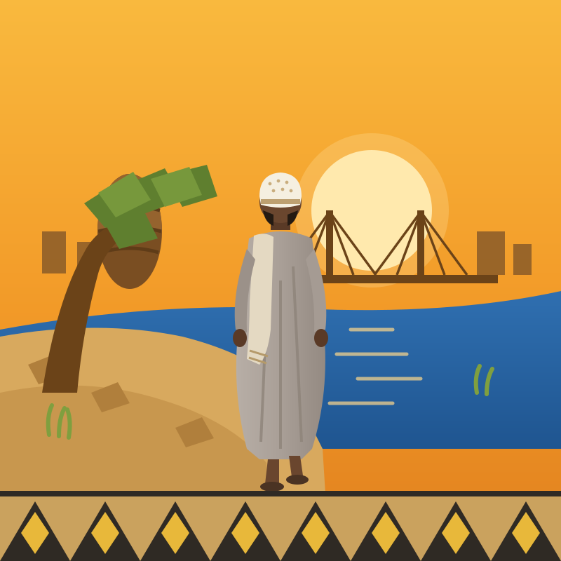

# الخرطوم — عالم مفتوح 🇸🇩

لعبة ثلاثية الأبعاد بعالم مفتوح في مدينة الخرطوم، تلعب فيها بشخصية **«علاء الدين»**:
رجل سوداني بجلابية رمادية فاتحة، وطاقية بيضاء مزخرفة، ونظارة، ولحية، وساعة يد —
مبنية بالكامل حسب لوحة تصميم الشخصية المرجعية.



## ✨ ماذا يوجد في اللعبة؟

- **مدينة الخرطوم الثلاثية**: الخرطوم، أم درمان، وبحري — يفصل بينها النيل الأزرق والنيل الأبيض ويلتقيان عند **المقرن** حول **جزيرة توتي** الخضراء.
- **12 معلماً حقيقياً**: برج الفاتح، القصر الجمهوري، جامعة الخرطوم، الجامع الكبير، السوق العربي، مسجد النيلين، قبة الإمام المهدي، سوق أم درمان، استاد المريخ، استاد الهلال، المقرن، وجزيرة توتي.
- **4 كباري** تعبر بها بين المدن الثلاث، منها كبري المك نمر المعلق بالكوابل وكبري توتي.
- **نظام مهام**: 10 مهام تقودك عبر المدينة بمؤشر ماسي ذهبي متوهج (كما في ألعاب العالم المفتوح)، ثم استكشاف حر.
- **حياة سودانية**: ركشات تجوب الشوارع، حافلات كوستر زرقاء وبيضاء، كارو بحماره، مراكب شراعية على النيل، ست الشاي ببراريدها وبنابرها الملونة، ماعز في أم درمان، سكان بجلاليب وعمم وثياب ملونة، عجلة دوارة في حديقة المقرن، ونخيل على الكورنيش.
- **خريطة مصغرة دائرية** بمؤشر الشمال وهدف المهمة، وعدّاد المعالم المكتشفة، وأجواء غروب خرطومية دافئة.

## 🎮 التحكم

| المنصة | الحركة | الكاميرا | الجري |
|---|---|---|---|
| **الحاسوب** | الأسهم أو WASD | سحب بالفأرة + عجلة للتقريب | Shift |
| **الهاتف** | المس النصف الأيسر (عصا افتراضية) | اسحب النصف الأيمن | زر «جري» |

## ▶️ التشغيل

اللعبة ملفات ثابتة بلا أي خادم أو اعتماديات خارجية (مكتبة Three.js مضمّنة محلياً):

- **مباشرة**: افتح `index.html` في المتصفح.
- **أو بخادم محلي**: `python3 -m http.server` ثم افتح `http://localhost:8000`.
- **أو GitHub Pages**: فعّل Pages على هذا الفرع/المستودع وستعمل اللعبة من الرابط على الهاتف والحاسوب.

## 🖼️ الشعار (اللوقو)

شاشة البداية تبحث أولاً عن **`assets/logo.png`** — ضع صورة الشعار الأصلية بهذا الاسم
لتظهر كما هي تماماً. إن لم يوجد الملف، تُستخدم النسخة المرسومة `assets/logo.svg` تلقائياً.

## 🗂️ بنية المشروع

```
index.html      واجهة اللعبة (RTL بالعربية) وشاشة البداية
js/game.js      محرك اللعبة كاملاً: العالم، الشخصية، المهام، التحكم
lib/three.min.js مكتبة Three.js (مضمنة محلياً)
assets/logo.svg الشعار الاحتياطي المرسوم
```
