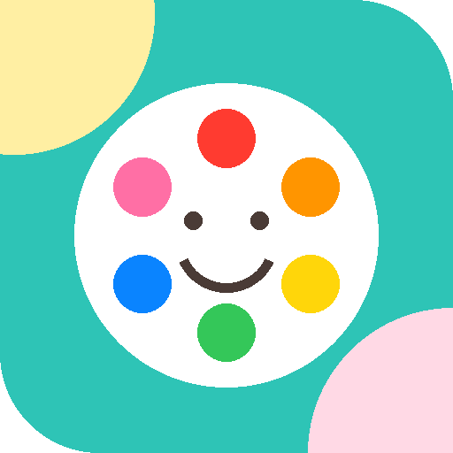

# 🎨 عالم الألوان مع جنان

تطبيق تلوين للأطفال بعمر **3 سنوات** — يعمل كتطبيق أندرويد مثبَّت (APK) وكتطبيق ويب (PWA)، **بدون إنترنت إطلاقًا** وبدون إعلانات.

<p align="center"></p>

## 📱 التثبيت على الهاتف (APK)

الملف الجاهز: **[`dist/JinanColors-1.0.apk`](dist/JinanColors-1.0.apk)** — موقّع بمخططات v1 + v2 + v3، ويعمل على أندرويد 5.0 فأحدث.

1. انقلي الملف إلى الهاتف (واتساب، بلوتوث، كابل، أو نزّليه من GitHub).
2. افتحيه، ثم اسمحي بـ«التثبيت من مصادر غير معروفة» عند طلب النظام.
3. ستظهر أيقونة التطبيق على الشاشة الرئيسية.

## ✨ ما يقدّمه التطبيق

### كتابان جاهزان للتلوين (33 رسمة)
| الكتاب | المحتوى |
|---|---|
| **كتاب المهن** | 21 رسمة واقعية جميلة: طبيبة، معلّمة، طاهية، طيّارة، إطفائية، رسّامة، رائدة فضاء، شرطية، مزارعة، مهندسة، عالِمة، خبّازة، عازفة، ممرضة، محقّقة، ساعية بريد، بستانية، أمينة مكتبة، بنّاءة، طبيبة بيطرية، لاعبة كرة |
| **كتاب جنان الأول** | 12 رسمة كبيرة بخطوط سميكة: سمكة، قطة، فراشة، زهرة، شمس، بيت، سيارة، بالونات، أرنب، آيس كريم، تفاحة، نجمة |

ويمكن للوالدين إضافة أي **كتاب تلوين PDF** ليتحوّل تلقائيًا إلى صفحات قابلة للتلوين.

### ثماني أدوات تلوين
🪣 **تعبئة** بلمسة واحدة (الافتراضية) · 🔶 **نقشة** (نقاط، خطوط، قلوب، نجوم، مربعات، فقاعات) · 🖌️ **فرشاة** · 🌈 **قوس قزح** · ✨ **لمعان** · 💨 **رشّاش** · ⭐ **طوابع** · 🧽 **ممحاة** — بثلاثة أحجام بسيطة.

### ✨ التلوين السحري
زر واحد يلوّن كل أجزاء الرسمة بألوان متناغمة في أقل من نصف ثانية — مع قصاصات احتفالية وأصوات مبهجة.

### مصمّم لطفلة عمرها 3 سنوات
- أزرار كبيرة (52 بكسل فأكثر)، خط عربي مستدير (Baloo Bhaijaan 2)، وألوان دافئة مريحة.
- **نطق عربي** لاسم كل لون وكل مهنة عند اختيارها (تعلُّم أثناء اللعب).
- أصوات مرحة مولّدة داخل التطبيق، واحتفال بالقصاصات عند حفظ اللوحة.
- **حفظ تلقائي** لكل صفحة + **معرض أعمالي** + حفظ اللوحة في صور الجهاز باسم الفنانة.
- **منطقة والدين محمية** بضغط مطوّل 3 ثوانٍ: رفع كتب PDF، حذفها، إيقاف الأصوات والنطق، ومسح التلوينات.
- **آمن تمامًا**: لا إعلانات، لا روابط خارجية، لا تتبّع — كل البيانات داخل الجهاز فقط.

## 🛠️ البناء من المصدر

```bash
bash android/build-apk.sh      # ← ينتج android/build/JinanColors.apk
```

يحتاج: `aapt2` · `javac` (JDK 8+) · `zipalign` · `apksigner` · `android.jar`، ومُجمِّع DEX المرفق في `android/tools/`.
على أوبونتو/دبيان: `apt-get install aapt apksigner zipalign android-sdk-platform-23 android-sdk-build-tools`

> **مفتاح التوقيع**: يُنشأ تلقائيًا في `android/build/jinan.keystore` عند أول بناء. للنشر على Google Play استخدمي مفتاحًا ثابتًا خاصًا بك عبر المتغيّرين `KEYSTORE` و`KEYSTORE_PASS`، واحتفظي به في مكان آمن.

## 🌐 النسخة الويب (PWA)

نفس الملفات تعمل كموقع: ارفعي مجلد المشروع على أي استضافة ثابتة (مثل Netlify Drop)، ثم من متصفح الهاتف اختاري «إضافة إلى الشاشة الرئيسية».

```bash
python3 -m http.server 8000    # تجربة محلية على http://localhost:8000
```

## 📁 بنية المشروع

| المسار | الوظيفة |
|---|---|
| `index.html` | التطبيق كاملًا (واجهة + محرّك التلوين) |
| `pages/professions/` | 21 صفحة تلوين منظّفة + مصغّراتها |
| `fonts/` · `vendor/` | الخط العربي وقارئ PDF — محليًا للعمل دون إنترنت |
| `android/` | مشروع أندرويد الأصلي وسكربت البناء |
| `dist/` | ملف APK الجاهز للتثبيت |
